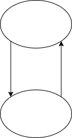

# 标题

## 标题2

## 标题2

### 标题3

#### 标题4

##### 标题5

###### 标题6

> 这是引用

1. 打开冰箱

2. 塞进去

3. 观赏冰箱

无序列表

- 黄
- 国
- 鹏鹏
- 试试看
  
- 哈哈哈

明天要做的事

- [x] 吃饭
- [x] 睡觉
- [x] 打豆豆

```c
int main()
{
    return 0;
}
```

数学公式：
$x^2+y^2=1$
$$
    \begin{array}{l}
    leftform = (A \wedge B) \to C\\
    = \neg (A \wedge B) \vee C\\
    = \neg A \vee \neg B \vee C\\
    = \neg A \vee C \vee \neg B \vee C\\
    = \neg A \vee C \vee \neg B \vee C\\
    = (A \to C) \vee (B \to C) \\
    = rightform
   \end{array}
$$

表格:
|姓名|年龄|成绩|
|:--|---:|:----:|
|张三|19|99|

脚注:
一件三联[^sanlian]
[^sanlian]:点赞、投币、收藏，最好在关注一下
横线:

---

哈哈哈

[百度](www.baidu.com "一个搜索引擎")
[百度][id]

[id]:www.baidu.com "一个搜索引擎"

请参考[标题1](#标题)

URL:

<http://www.baidu.com>



*强调使用* 试试看 <u>下划线</u>, :smile: 
**加粗使用** `printf("%d)行内代码`
H~2~O(下标)
X^2^(上标)
==高亮==

<iframe src="//player.bilibili.com/player.html?aid=327623069&bvid=BV1JA411h7Gw&cid=171385214&page=1" scrolling="no" border="0" frameborder="no" framespacing="0" allowfullscreen="true"> </iframe>

### 标题3

#### 标题4

##### 标题5

###### 标题6

> 这是引用

1. 打开冰箱

2. 塞进去

3. 观赏冰箱

无序列表

- 黄
- 国
- 鹏鹏
- 试试看
  
- 哈哈哈

明天要做的事

- [x] 吃饭
- [x] 睡觉
- [x] 打豆豆

```c
int main()
{
    return 0;
}
```

数学公式：
$x^2+y^2=1$

$$
    \begin{array}{l}
    leftform = (A \wedge B) \to C\\
    = \neg (A \wedge B) \vee C\\
    = \neg A \vee \neg B \vee C\\
    = \neg A \vee C \vee \neg B \vee C\\
    = \neg A \vee C \vee \neg B \vee C\\
    = (A \to C) \vee (B \to C) \\
    = rightform
   \end{array}
$$

表格:
|姓名|年龄|成绩|
|:--|---:|:----:|
|张三|19|99|

脚注:
一件三联[^sanlian]
[^sanlian]:点赞、投币、收藏，最好在关注一下
横线:

---

哈哈哈

[百度](www.baidu.com "一个搜索引擎")
[百度][id]

[id]:www.baidu.com "一个搜索引擎"

请参考[标题1](#标题)

URL:

<http://www.baidu.com>


*强调使用* 试试看 <u>下划线</u>, :smile: 
**加粗使用** `printf("%d)行内代码`
H~2~O(下标)
X^2^(上标)
==高亮==

I am trying 2 to code with the new keyborad, it is a little noisy

<iframe src="//player.bilibili.com/player.html?aid=327623069&bvid=BV1JA411h7Gw&cid=171385214&page=1" scrolling="no" border="0" frameborder="no" framespacing="0" allowfullscreen="true"> </iframe>
